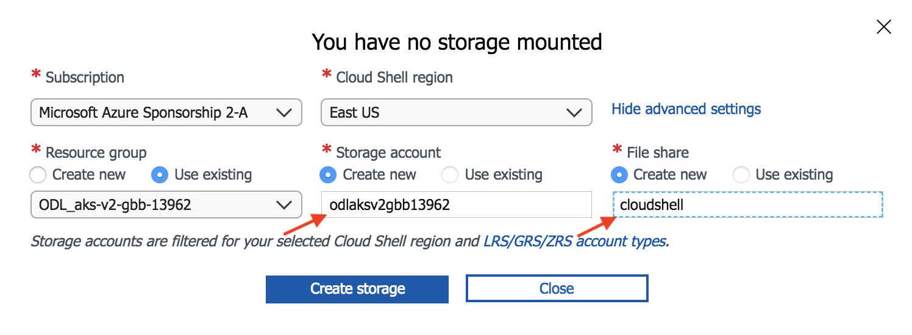

# Lab Requirements

## Classroom Setting

These labs are designed for delivery in a bootcamp setting at the **Azure Global Bootcamp**. We typically provide an Azure subscription for attendees to complete the labs.

### Setup Environment

* The first two labs will require you to work from your local machine. If your machine does not meet the minimum requirements, you can skip ahead to Lab 3.

* Local Development Requirements:
  * Azure subscription
  * Linux, Mac, or Windows with Bash
  * Docker CE (Docker Toolbox will cause you pain and angst)
  * Azure CLI
  * Visual Studio Code
  * Helm
  * Kubernetes CLI (kubectl)
  * MongoDB (only lab #1 requires this)
  * GitHub account and git tools

* Setup Azure Cloud Shell:

    1. Browse to http://portal.azure.com
    2. Login with the Azure credentials that were given to you at the bootcamp.
    3. Click on the cloud shell icon to start your session.

        

    4. Select `Bash (Linux)`
    5. You will be prompted to setup storage for your cloud shell. Click `Show advanced settings`

        

    6. Provide a unique value for Storage account name. This must be all lower case and no punctuation. Use "cloudshell" for File share name. See example below.

        

    7. Click `Create storage`

    > Note: You can also use the dedicated Azure Cloud Shell URL: http://shell.azure.com 
